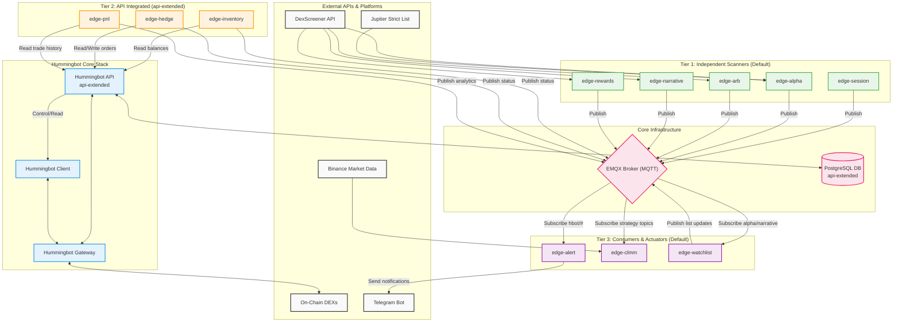

# Hummingbot & Python Edge Services Architecture

This document shows the current DEX-lean production architecture and the optional API-extended profile.

### Runtime Profiles

- **Default DEX-lean profile**: `emqx`, `hummingbot`, `gateway`, `edge-session`, `edge-alpha`, `edge-arb`, `edge-narrative`, `edge-rewards`, `edge-alert`, `edge-clmm`, `edge-watchlist`.
- **Optional `api-extended` profile**: adds `postgres`, `hummingbot-api`, `edge-inventory`, `edge-hedge`, `edge-pnl`.

### Key Interactions

1. **Tier 1 (Data ingest + signal generation)**: `session`, `alpha`, `arb`, `narrative`, and `rewards` publish market and strategy signals to EMQX.
2. **Tier 2 (Optional API interoperability)**: `inventory`, `hedge`, and `pnl` consume Hummingbot API endpoints while also publishing state and analytics to MQTT.
3. **Tier 3 (Signal consumers)**: `alert`, `clmm`, and `watchlist` subscribe to MQTT topics; `alert` pushes operator notifications to Telegram.
4. **Core trading path**: Hummingbot and API coordinate through Gateway for on-chain execution, with PostgreSQL persistence enabled only in `api-extended`.
