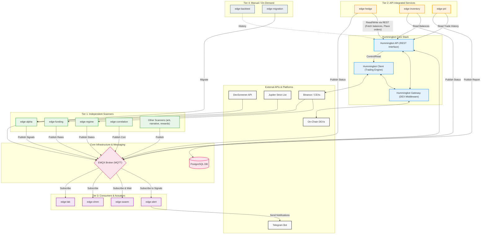

# Hummingbot & Python Edge Services Architecture

This document visualizes how the core Hummingbot stack interacts with the Python-based edge microservices.

### Key Interactions:

1. **Tier 1 (Data Ingest & Analysis)**: Independent microservices (`alpha`, `regime`, `correlation`, etc.) pull data from external APIs (like DexScreener and Jupiter), crunch numbers/scores, and publish their findings to specific topics on the **EMQX MQTT Broker**.
2. **Tier 2 (Hummingbot Interoperability)**: Services like `hedge`, `inventory`, and `pnl` need direct access to reading bot states and executing trades. They achieve this by combining **MQTT** (for sharing state) and the **Hummingbot API** (via REST: `http://hummingbot-api:8000`) to place orders, check balances, and fetch trade histories.
3. **Hummingbot Core**: The API handles interaction requests and persists states into the **PostgreSQL DB**. Both API and Hummingbot depend on the **Gateway** to translate commands for decentralized interactions (e.g. interacting with solana/EVM DEXs).
4. **Tier 3 (Execution & Notification)**: Services like `alert` and `swarm` act as passive listeners. They subscribe to topics on **MQTT**, and when conditions are met (like a high-score Alpha matching a Bullish Regime), they trigger events like sending Telegram alerts or spawning new trading bots based on rules.
