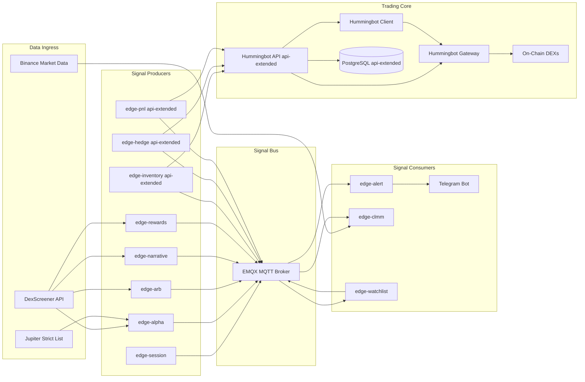

# Hummingbot and Edge Services Architecture

This document uses GitHub-compatible Mermaid flowcharts and separates the system into four layers: data ingress, signal bus, trading core, and consumers.

## System Flow

## Runtime Profiles

- Default DEX-lean profile: `emqx`, `hummingbot`, `gateway`, `edge-session`, `edge-alpha`, `edge-arb`, `edge-narrative`, `edge-rewards`, `edge-alert`, `edge-clmm`, `edge-watchlist`
- Optional `api-extended` profile adds: `postgres`, `hummingbot-api`, `edge-inventory`, `edge-hedge`, `edge-pnl`

## Architecture Notes

1. Producers are write-only to MQTT and do not depend on consumers.
2. Consumers are isolated by topic subscriptions and can scale independently.
3. Signal topics are chain-aware (`.../{chain}/...`) for alpha, arb, narrative, and watchlist flows.
4. Per-chain threshold maps are used for discovery and publish gating to keep Solana stricter while keeping Base/Arbitrum broader.
5. `api-extended` services integrate with Hummingbot API without changing default runtime behavior.
6. Gateway is the on-chain execution boundary for both client and API control paths.

## Flowchart Conventions Used

- One direction (`LR`) to reduce edge crossings.
- Layered subgraphs for ownership and responsibility boundaries.
- Minimal node label punctuation to avoid Mermaid parser edge cases on GitHub.
- No advanced Mermaid directives so preview renders consistently in GitHub markdown.
